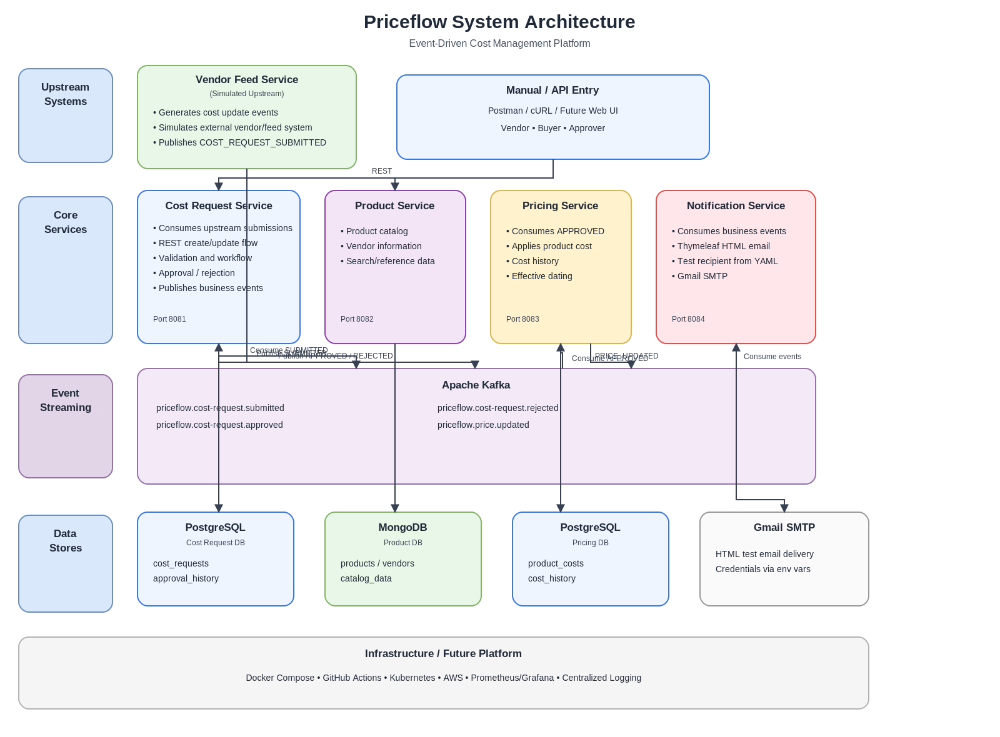

# Priceflow

Priceflow is a production-style, event-driven vendor cost and pricing management platform built as a personal portfolio project.

The project demonstrates a microservices-based backend architecture using Java, Spring Boot, Apache Kafka, PostgreSQL, MongoDB, containerization, and cloud-native deployment practices.

## System Architecture

Priceflow follows an event-driven microservices architecture that simulates an end-to-end enterprise cost management workflow.

Cost updates can enter the platform through a simulated upstream vendor feed or through REST APIs. Cost requests are validated and processed through an approval workflow before approved changes are propagated asynchronously to downstream pricing and notification services using Apache Kafka.



> The editable architecture diagram is available at [`docs/architecture/Priceflow-architecture.drawio`](docs/architecture/Priceflow-architecture.drawio).

## High-Level Event Flow

```text
Vendor Feed Service (Simulated Upstream)
                │
                │ COST_REQUEST_SUBMITTED
                ▼
          Apache Kafka
                │
                ▼
       Cost Request Service
                │
        Validation / Approval
                │
        ┌───────┴────────┐
        │                │
     APPROVED         REJECTED
        │                │
        ▼                ▼
    Apache Kafka Event Bus
        │                │
        ▼                ▼
 Pricing Service   Notification Service
        │
        ▼
   PRICE_UPDATED
        │
        ▼
    Apache Kafka
        │
        ▼
 Notification Service
```

The Cost Request Service also exposes REST APIs so cost requests can be submitted manually through API clients or a future web application.

## Services

| Service | Responsibility | Port |
|---|---|---:|
| `vendor-feed-service` | Simulates an external upstream system and publishes cost update events | 8080 |
| `cost-request-service` | Manages cost requests, validation, workflow, approvals, and rejections | 8081 |
| `product-service` | Provides product, vendor, and catalog reference data | 8082 |
| `pricing-service` | Applies approved cost changes and maintains pricing history | 8083 |
| `notification-service` | Consumes business events and sends HTML email notifications | 8084 |

## Technology Stack

- Java 21
- Spring Boot
- Spring WebFlux
- Apache Kafka
- Maven
- PostgreSQL
- MongoDB
- Redis
- Thymeleaf
- Docker / Docker Compose
- Kubernetes
- GitHub Actions

## Repository Structure

```text
Priceflow/
├── services/
│   ├── vendor-feed-service/          # Simulated upstream
│   ├── cost-request-service/         # Cost request lifecycle
│   ├── product-service/              # Product and vendor data
│   ├── pricing-service/              # Downstream pricing processing
│   └── notification-service/         # Event-driven email notifications
│
├── docs/
│   └── architecture/
│       ├── Priceflow-architecture.drawio
│       └── Priceflow-architecture.png
│
├── infrastructure/
│   ├── docker/
│   └── kubernetes/
│
├── .github/
│   └── workflows/
│
└── README.md
```

## Current Status

The project foundation and system architecture have been established.

The initial `cost-request-service` Spring Boot application is configured and running successfully with:

- Java 21
- Maven
- Spring Boot
- Spring WebFlux
- Validation
- Lombok
- Spring Boot Actuator

Application health is exposed through Spring Boot Actuator.

Additional services and infrastructure will be implemented incrementally.

## Planned Capabilities

- Simulated upstream vendor cost feed
- Vendor cost change request lifecycle
- Product and catalog lookup
- Cost request validation
- Approval and rejection workflow
- Kafka-based event-driven communication
- Pricing updates and cost history
- HTML email notifications
- Retry and dead-letter handling
- Authentication and authorization
- PostgreSQL and MongoDB persistence
- Redis caching
- Observability and centralized logging
- Docker Compose local development
- Kubernetes deployment
- CI/CD with GitHub Actions